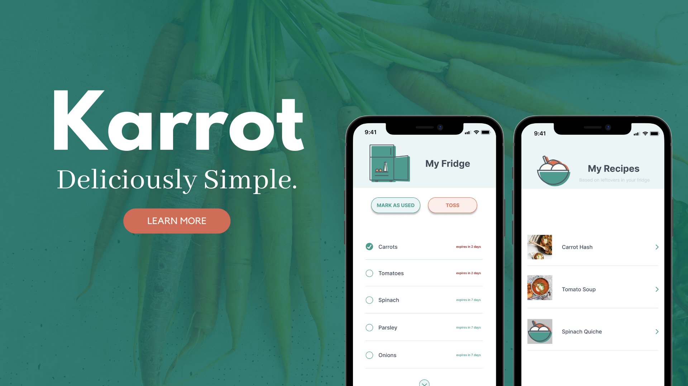
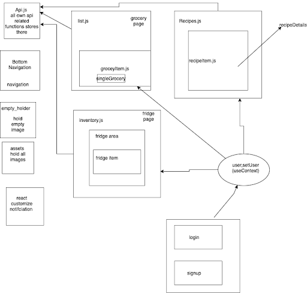
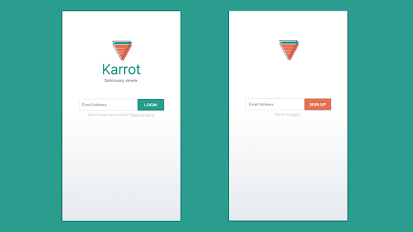
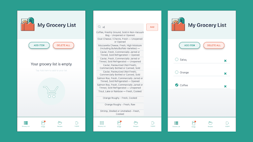
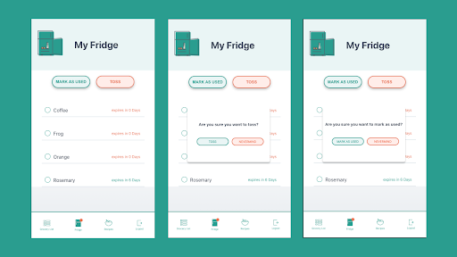
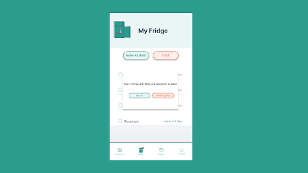
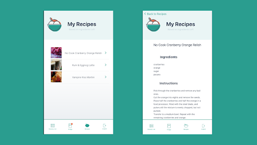

# KARROT

## Summary

A website that makes it easy for millennial home cooks to create a grocery list, keep track of their food inventory, remind them when food is about to go bad, and a fun way to learn more food and cooking tips.

## Technologies

- Front-end: React.js, JSX, React-notification
- Back-end: Node.js, Express
- Database: Postgresql
- Hosting: Heroku and Netify

## Installation

1. Clone the repository
2. npm install at root level (backend)
3. cd into /public folder and npm install (frontend)
4. Set .env file with DATABASE_URL from Heroku, API_KEY, API_KEY_SPARE from Spoonacular (for local development)
5. Run npm start in /public folder and node app.js at root level to run front and backend respectively

## API Routes

All routes accessible via https://food-ping.herokuapp.com/.

- `/` testing page which returns 'PING ME'.
- `/searchItem?item={}` search for items from Still Tasty based on the item query searched.
- `/getDetails?query_id={}` get the shelf life of an item from Still Tasty.
- `/getRecipes?ingredients={}` get a list of recipes that match the ingredient(s) criteria from Spoonacular.
- `/getRecipeInfo?query_id={}` get more information about a single recipe based on the query id passed as parameter from Spoonacular.
- `/getUser?email={}` retrieve a user record based on the email parameter.
- `/getGroceries?user_id={}` retrieve a user's grocery list.
- `/getInventory?user_id={}` retrieve a user's fridge inventory.
- `/addUser?email={}` add a new user with the email parameter.
- `/addGroceryItem?item_name={}&user_id={}&query_id={}` add an item to a user's grocery list.
- `/addInventoryItem?item_name={}&user_id={}&expiry_time={}&query_id={}` add an item to a user's fridge inventory.
- `/editGroceryTag?tag={}&user_id={}&item_id={}` update an item's tag to 'not bought' or 'bought' in a user's grocery list.
- `/editDisplayTag?user_id={}&item_id={}&tag={}` mimic the delete functionality on the user's grocery list by passing either 'deleted' or 'not deleted' as the tag.
- `/editInventoryTag?tag={}&user_id={}&item_id={}` update an item's tag to 'not expired', 'expired' or 'used' in a user's fridge inventory.
- `/editUsageTag?user_id={}&item_id={}&tag={}` update the tag to either 'tossed' or 'used' for an item in a user's inventory.

## Functions

- `expiryCheck` a CRON scheduler to update the inventory tag to 'expired' from 'not expired' if today's date is greater than or equal to an item's expiry date; rule is currently set to check every midnight.
- `autoAddItem` a utility function that automatically adds an item to the inventory table should an item be checked i.e. tag is updated to 'bought' in the groceries table.
- `autoDeleteItem` a utility function that automatically deletes an item to the inventory table should an item be unchecked i.e. tag is updated to 'not bought' in the groceries table.
- `convertExpiry, addExpiry`: utility functions that receive the shelf life in seconds, converts the value to days and calculates the expiry date based on the input date.

## Front-End Design

- Api.js : stores all api related functions.
- Naviagation: includes a bottom navigation bar and a navigation bar created specifically for the static recipe page.
- EmptyHolder: displays a default holder when page data doesn't render.
- Assets：contains all related photos, logo, and icons.
- Notification: contains all customized small size and large size notifications.
- Pages: list page is for the grocery list page, inventory is for the fridge page, recipe is for the recipe page; for each page, it includes an area holder and child component as a single item.
- useContext: stores the user id, expired item(s) and functions to set them.
- login and signup: uses a reuseable form to capture the input and complete the loop.

## Features

- Users can use their email to signup and login.
  If the email is incorrect, it will give an error message to the user.

- Users can search for and add multiple items to their grocery list by clicking on the “Add Item” button.
  When users check items on their grocery list, they are automatically added to their fridge.
  If they make a mistake, they can uncheck items to remove the item from their fridge.
  Users can easily remove all items from their grocery list by clicking on the “Delete All” button.

- Items added to the fridge are listed by closest expiration date.
  Users can select multiple items and select the “Mark as Used” or “Mark as Tossed” buttons.
  For both options, “Mark as Used” and “Mark as Tossed”, a pop up will ask users to verify the action, or they can click “Nevermind” to cancel the action.

- If there are items that are going to expire within two days, an orange dot will appear on the top right corner of the fridge icon.
  When users click on the fridge icon with a notification, a message pops up that tells the user which ingredients are about to expire. The user has two options: click “Got It!” or “Show Recipes”.

- Users will find three recipe suggestions based on the ingredients they have in their fridge, and they can click on the recipe title to be directed to another page with more details.

## Issues

## Contributions

## License
